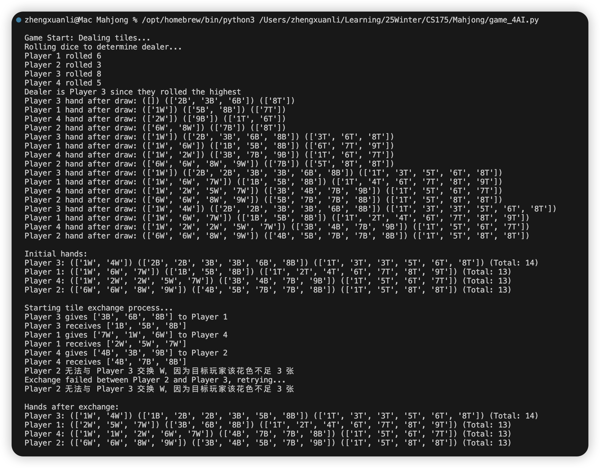
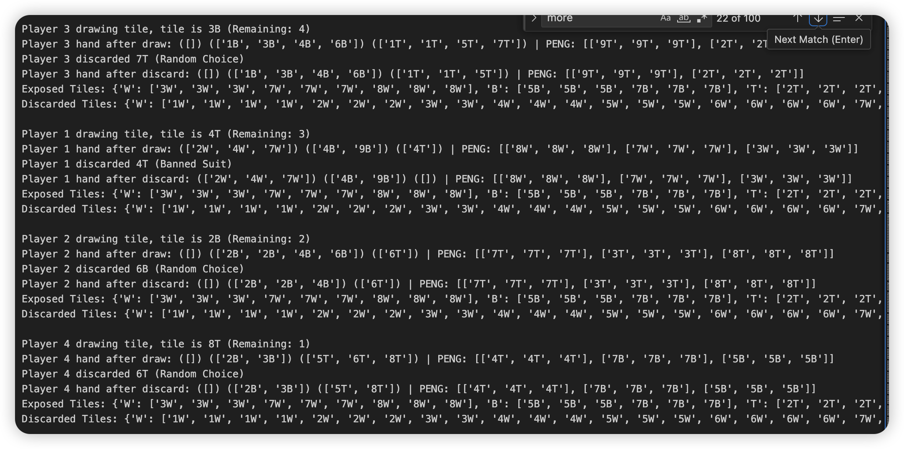
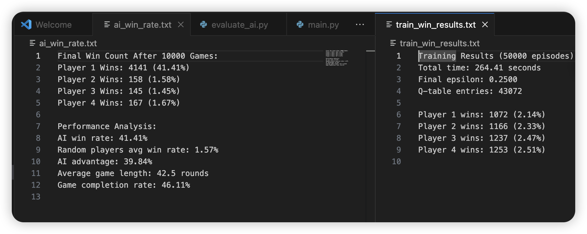
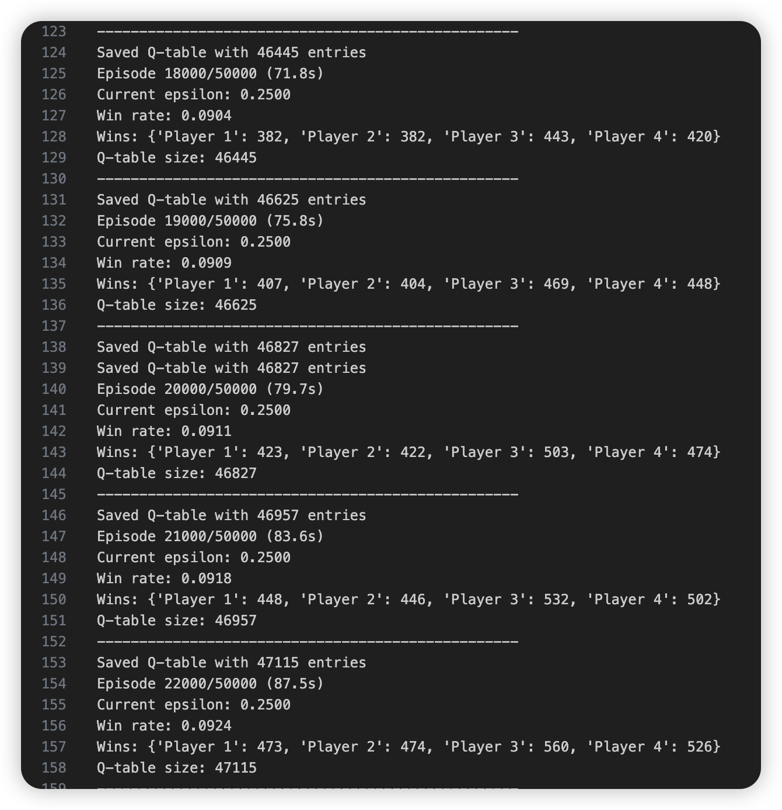

Source code: https://github.com/lzxtxdys/Mahjong

## Final Report Video

<iframe width="560" height="315" src="https://youtu.be/4jGCWwF3Yqg" 
frameborder="0" allow="accelerometer; autoplay; clipboard-write; encrypted-media; gyroscope; 
picture-in-picture" allowfullscreen></iframe>

## Project Summary
My primary goal is that the AI player can constantly learn better strategy from the games, verify if the strategy are actually effective and play along the strategy with calculation system. The expectation is the AI can reach a balance between high winning rate and high value winning combination. 

Challenge 1: Many little bugs.
The game is full of rule interactions hence inevitablly there will be few tiny bugs that we cannot find out where the problem is.

Challenge 2: It is hard to completely simulate a "right" strategy. 
It means that sometimes there are no absolute right or wrong in the strategy. My algorithm method is to assign parameter "risk" to evaluate whether this tile is a safe or a dangerous one. The risk level depends on whether this tile has been exposed or discarded. For example, if a tile has never been exposed or discarded, it is highly possible that people are holding them and if a player discard it, someone will win. However, it is possible that all tiles are staying in the rest deck. In this situation, the player will choose to hold the marked "high risk & dangerous" tile, even if it may cause the holding tile player not to win

Challenge 3: The win rate and high-value counts are not as high as we expected. 
In this project, we are using decision tree and Q-table to achieve constance choices and calculations. However, these two strategies tend to know what tiles will make others to win so that it will always keep it. Such a behavior leads to a consequence that such kept dangerous tiles will take a place in their hands so that the player has to abandon some drawed tiles that may lead the player to win or pursue a higher value combination. As shown in the following picture, the train_win_results.txt is 4AI players game result and the ai_win_rate.txt is 1AI player game result. As we can see, compared to the 4AI game, the 1AI has nearly 20 times win counts. But it is still only 20%
However, the win rate is not high enough is definitely a problem since this is what AI should do. For the high-value combination counts, I am not sure whether it is a problem. Through the project working, I have checked some great human players video and I have noticed that even if their winning rate is higher than other players, they are mostly not winning by getting high-value combination, which means they are also using defensive strategy. This is reasonable because if one player is always avoiding losing credits, even if they win by a low-value combination, they are also winning credits.

## Approaches
### Baseline (Naïve) Approach: Random Discard Strategy
A random discard strategy was implemented as the baseline approach, where AI players discard tiles at random, without considering game state, opponent behavior, or optimal strategy. This method is computationally simple, requiring no decision-making algorithms or learning process. It serves as a useful control to compare against more advanced AI approaches.

Advantages:
1. Simple to implement – Requires no advanced algorithms, making it easy to test.
2. Computationally efficient – Does not require extensive training or memory usage.
3. Provides a control benchmark – Helps evaluate the effectiveness of more complex strategies.

Disadvantages:
1. No strategic awareness – The AI does not prioritize strong tile formations or defensive play.
2. Ignores opponent moves – Cannot anticipate Peng, Gang, or potential winning hands from other players.
3. Very low win rate – Often discards useful tiles, leading to slow and inefficient gameplay.

This baseline approach was used to test how well a trained AI performs against purely random players, serving as a benchmark to measure AI progress.

### Proposed Approach: Reinforcement Learning (RL) with Q-Learning
To create a more competitive AI, we implemented Q-learning, a model-free reinforcement learning algorithm that allows the AI to learn from past decisions and optimize its tile discards based on experience. The AI maintains a Q-table, where it stores state-action pairs and updates them based on rewards received from game outcomes. The AI prioritizes discards based on learned experience, selecting tiles that maximize its winning potential while minimizing the risk of assisting opponents.

Advantages:
1. Learns from experience – Improves decision-making over time by updating the Q-table.
2. Strategic tile selection – Prioritizes discards that increase the chance of forming valid Hu hands.
3. Defensive play – Learns to avoid discarding dangerous tiles that could help opponents win.
4. Higher win rate – Outperforms the random discard strategy after sufficient training.

Disadvantages:
1. Defensive Strategy – rather to keep dangerous tiles even if it may lead itself to not hu.
2. Slow convergence – Learning efficiency is limited by the exploration-exploitation tradeoff.
3. Memory-intensive – The Q-table grows significantly with state complexity, leading to potential scalability issues.
3. Limited generalization – Does not easily adapt to unseen strategies or advanced human play styles.

While Q-learning significantly improves the AI’s performance over random discards, it is still limited by its reliance on discrete state-action pairs, making it less effective in highly variable game scenarios.

## Evaluation
### Method 1: 4AI Game VS 1AI Game.

train_win_results.txt------4AI players game result.
ai_win_rate.txt------------1AI player game result.

In this photo, you can see that 1AI winning games count is 20 times of the 4AI one. It means that the AI player performs better by playing along the RL-based decision-making and utilizing the tiles calculation board system. As we can see, The random discard strategy is ineffective, reinforcing the value of AI decision-making and AI performance is stable, suggesting that it learned optimal strategies over training.

### Method 2: Learning Over Time

To measure how the AI improves with training, we logged its win count over 10,000 training games.
1. Self-play training: AI competes against itself to refine strategies.
2. Training progress logged in train_log.txt every 100 episodes.
3. Final win statistics saved in train_win_results.txt.

### Method 3: AI Decision-Making Behavior

To analyze how well the AI plays, we observed several decision-making patterns that emerged

AI Strengths:
1. Strategically avoids discarding tiles that may complete opponents' sets.
2. Recognizes safe discards in the late game when fewer tiles remain.
3. Consistently builds valid Mahjong hands, prioritizing Peng and Hu opportunities. Also, in the lastest 100 games, I can see the trend of making high-value combinations

Goal
1. Build an AI capable of learning optimal Mahjong strategies     (achieved)	            RL-trained AI achieves 19.94% win rate
2. Track AI improvement through self-play                         (achieved)                AI steadily improves performance over training
3. Test AI against weaker random players                          (achieved)                AI dominates random players in controlled experiments

## References
1. https://www.geeksforgeeks.org/decision-tree/
2. https://medium.com/@samina.amin/deep-q-learning-dqn-71c109586bae
3. https://www.geeksforgeeks.org/what-is-reinforcement-learning/
4. https://huggingface.co/learn/deep-rl-course/en/unit0/introduction
5. https://www.reddit.com/r/reinforcementlearning/
6. https://www.lucidchart.com/pages/decision-tree
7. https://asana.com/resources/decision-tree-analysis
8. https://www.ibm.com/think/topics/reinforcement-learning
9. https://www.youtube.com/watch?v=L_4BPjLBF4E

## AI Tool Usage

The only part I have used AI is the discard_tile function in Class Player. As I mentioned before, this game is full of rules interactions and it is really hard for me to develop a perfect function. I still keep the primary editions of my own discard_tile functions and it all go bad when I test it.

